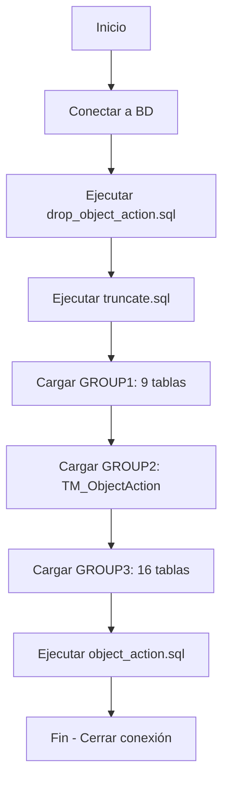

# Levantamiento - Carga de Datos desde CSV a Base de Datos

## 📋 Descripción General

**Levantamiento** es el **segundo paso** del sistema ETL. Se ejecuta en una máquina virtual diferente a Backup_Prima y tiene como objetivo cargar los archivos CSV generados por el proceso anterior hacia una base de datos de integración (TeamMate_Prima en servidor de producción).

## 🎯 Objetivo

Leer los 26 archivos CSV sincronizados desde OneDrive y cargarlos ordenadamente en la base de datos destino, ejecutando scripts SQL de preparación y validación.

## 🏗️ Arquitectura

```
┌────────────────────────────────────────┐
│   OneDrive/SharePoint (Sincronizado)  │
│   backup_prima_csv/                    │
│   ├── TM_Recommendation.csv            │
│   └── ... (26 tablas)                  │
└──────────────┬─────────────────────────┘
               │
               ▼
┌────────────────────────────────────────┐
│   Máquina Virtual 2                    │
│                                        │
│  ┌──────────────────────────────────┐ │
│  │    ultimito.py                   │ │
│  │    (Levantamiento)               │ │
│  └──────────┬───────────────────────┘ │
│             │                          │
│             ▼                          │
│  ┌──────────────────────────────────┐ │
│  │  Queries SQL                     │ │
│  │  ├── drop_object_action.sql      │ │
│  │  ├── truncate.sql                │ │
│  │  └── object_action.sql           │ │
│  └──────────┬───────────────────────┘ │
└─────────────┼──────────────────────────┘
              │
              ▼
┌────────────────────────────────────────┐
│  TeamMate_Prima Database               │
│  (PSTMMPRD0300)                        │
│  ├── TM_Recommendation                 │
│  ├── TM_Project                        │
│  └── ... (26 tablas cargadas)          │
└────────────────────────────────────────┘
```

## 📂 Estructura de Archivos

```
Levantamiento/
├── ultimito.py                 # Script principal de carga
├── ultimo.bat                  # Ejecutable batch
├── README.md                   # Esta documentación
└── queries/
    ├── drop_object_action.sql  # Elimina tabla temporal ObjectAction
    ├── truncate.sql            # Limpia tablas destino
    └── object_action.sql       # Recrea tabla ObjectAction
```

## 🔧 Configuración

### Conexión a Base de Datos

```python
CNXN_STR = (
    "Driver={ODBC Driver 17 for SQL Server};"
    "Server=PSTMMPRD0300;"
    "Database=TeamMate_Prima;"
    "UID=USTEAM02;"
    "PWD=ZU4repezaGefraMu;"
    "Encrypt=no;"
)
```

### Rutas Configuradas

```python
# Directorio donde están los CSV sincronizados desde OneDrive
CSV_DIR = r'E:\Sharepoint\Pacífico Compañía de Seguros y Reaseguros\Analítica e Innovación en Auditoría - 01. Resultados Scripts\backup_prima_csv'

# Directorio de queries SQL
QUERIES_DIR = r'E:\Proyectos\ETL\Levantamiento\queries'

# Tamaño de lote para inserciones
CHUNKSIZE = 10000
```

## 📊 Orden de Carga de Tablas

Las tablas se cargan en **3 grupos** respetando dependencias de claves foráneas:

### Grupo 1 - Tablas Base (9 tablas)
```python
GROUP1 = [
    'TM_RecommendationAction',
    'TM_Recommendation',
    'TM_Schedule',
    'TM_Issue',
    'TM_Project',
    'TM_CategoryValue',
    'TM_SecurityGroup',
    'TM_Auditor',
    'TM_User'
]
```

### Grupo 2 - Tabla Especial (1 tabla)
```python
GROUP2 = ['TM_ObjectAction']
```

### Grupo 3 - Tablas Dependientes (16 tablas)
```python
GROUP3 = [
    'EWP_Control', 'EWP_EntityToRisk', 'EWP_Project',
    'EWP_RiskToControl', 'EWP_Risk', 'TM_AuthRecommendation',
    'TM_Browser', 'TM_Link', 'TM_List_AuthRecRole',
    'TM_List_ProjectStatus', 'TM_List_RecActionType',
    'TM_List_RecommendationStatus', 'TM_Procedure',
    'TM_Program', 'TM_ProjectToOrgHierarchy',
    'TM_SecurityGroupToUser'
]
```

## ⚙️ Funcionamiento del Proceso

### 1. Scripts Pre-Carga

Antes de cargar datos, se ejecutan scripts SQL de preparación:

```python
PRE_SQL_SCRIPTS = [
    'drop_object_action.sql',  # Elimina TM_ObjectAction
    'truncate.sql'             # Limpia todas las tablas
]
```

#### Ejemplo: truncate.sql
```sql
TRUNCATE TABLE dbo.TM_Recommendation;
TRUNCATE TABLE dbo.TM_Project;
-- ... todas las tablas
```

### 2. Función: split_sql_batches()

Divide scripts SQL grandes en batches individuales:

```python
def split_sql_batches(script: str) -> list:
    """Divide un script SQL en batches separados por líneas 'GO'."""
    return [
        b.strip() for b in re.split(r"^GO\s*(?:\r\n?|\n)", script,
                                   flags=re.IGNORECASE|re.MULTILINE)
        if b.strip()
    ]
```

### 3. Función Principal: load_table_from_csv()

Esta función maneja la carga completa de cada tabla:

#### a) Lectura de Metadata

```python
cursor.execute("""
    SELECT COLUMN_NAME, DATA_TYPE, NUMERIC_PRECISION, 
           NUMERIC_SCALE, IS_NULLABLE
    FROM INFORMATION_SCHEMA.COLUMNS
    WHERE TABLE_SCHEMA='dbo' AND TABLE_NAME=?
    ORDER BY ORDINAL_POSITION
""", table)
cols_info = cursor.fetchall()
```

#### b) Manejo de IDENTITY_INSERT

Para tablas con columnas de identidad:

```python
cursor.execute("""
    SELECT COLUMN_NAME
    FROM INFORMATION_SCHEMA.COLUMNS
    WHERE TABLE_SCHEMA='dbo' AND TABLE_NAME=?
      AND COLUMNPROPERTY(
        object_id(TABLE_SCHEMA + '.' + TABLE_NAME),
        COLUMN_NAME, 'IsIdentity'
      ) = 1
""", table)
identity = cursor.fetchone()

if identity:
    cursor.execute(f"SET IDENTITY_INSERT dbo.{table} ON")
    cnxn.commit()
```

#### c) Procesamiento por Chunks

Lee el CSV en lotes de 10,000 filas:

```python
for idx, chunk in enumerate(
    pd.read_csv(csv_path, encoding='utf-8-sig', chunksize=CHUNKSIZE),
    start=1
):
    # Procesar chunk...
```

#### d) Validación de Datos

##### Campos de Texto NOT NULL
```python
for col, dtype, *_ in cols_info:
    if dtype in text_types:
        chunk[col] = chunk[col].fillna('<NULL>')
```

##### Campos INT NOT NULL
```python
for col, dtype, *_ in cols_info:
    if dtype in int_types:
        is_nullable = next(x for x in cols_info if x[0]==col)[4]
        if is_nullable == 'NO':
            nuls = int(chunk[col].isna().sum())
            if nuls > 0:
                raise RuntimeError(f"INT NOT NULL con nulos -> {col}")
```

#### e) Conversión de Tipos

```python
for col, dtype, *_ in cols_info:
    val = series[col]
    if pd.isna(val):
        row.append(None)
    elif dtype in int_types:
        row.append(int(val))
    elif dtype in ('decimal','numeric','float','real','money'):
        row.append(float(val))
    elif 'date' in dtype or 'time' in dtype:
        dt = pd.to_datetime(val)
        row.append(dt.to_pydatetime())
    else:
        row.append(str(val))
```

#### f) Inserción con Fallback

Intenta inserción por lotes, si falla, inserta fila por fila:

```python
try:
    cursor.fast_executemany = True
    cursor.executemany(insert_sql, rows)
    cnxn.commit()
    total_inserted += len(rows)
except Exception as batch_err:
    print(f"⚠️ Batch fallo. Probando fila a fila...")
    for r_idx, row in enumerate(rows, start=1):
        try:
            cursor.execute(insert_sql, row)
            cnxn.commit()
            total_inserted += 1
        except Exception as row_err:
            print(f"🚫 Fila {r_idx} error: {row_err}")
            raise
```

### 4. Scripts Post-Carga

Después de cargar todos los datos:

```python
POST_SQL_SCRIPTS = ['object_action.sql']
```

Recrea la tabla `TM_ObjectAction` con lógica especial.

## 🚀 Ejecución

### Manual
```bash
python ultimito.py
```

### Via Batch
```batch
ultimo.bat
```

### Programación Automática
Se ejecuta después del proceso **Backup_Prima** mediante tarea programada de Windows.

## 📈 Características Técnicas

### Validaciones Implementadas

1. **Verificación de Archivos**: Comprueba existencia de CSV antes de procesar
2. **Validación de Tipos**: Convierte datos al tipo SQL correcto
3. **Manejo de Nulos**: Diferencia entre campos nullable y not null
4. **IDENTITY INSERT**: Gestiona columnas de identidad automáticamente
5. **Detección de Overflow**: Previene errores de fecha fuera de rango

### Optimizaciones

- **Fast Execute Many**: Usa `fast_executemany` de pyodbc para inserciones rápidas
- **Chunks de 10K**: Procesa datos en lotes para optimizar memoria
- **Commits Granulares**: Commit después de cada chunk exitoso
- **Fallback Inteligente**: Si falla batch, intenta fila por fila

### Manejo de Errores

```python
# Si una fila falla, muestra información detallada
except Exception as row_err:
    print(f"  🚫 chunk {idx}, fila {r_idx} error: {row_err}")
    print(f"    Valores: {row}")
    raise
```

## 📊 Logging y Monitoreo

El proceso imprime información detallada:

```
Conectando a SQL Server...
Ejecutando script SQL: drop_object_action.sql
Ejecutando script SQL: truncate.sql
Scripts SQL ejecutados.

---- Cargando tabla TM_Recommendation ----
IDENTITY_INSERT ON para TM_Recommendation
  Chunk 1: insertadas 10000 filas
  Chunk 2: insertadas 10000 filas
  Chunk 3: insertadas 5432 filas
IDENTITY_INSERT OFF para TM_Recommendation
✔️ Total filas insertadas en TM_Recommendation: 25432

...

Proceso completo en 145.32 segundos
```

## 🔄 Flujo Completo



## ⏱️ Tiempo de Ejecución

Aproximadamente **2-3 minutos** dependiendo del volumen de datos.

## 🛠️ Dependencias

```python
import os
import re
import time
import pyodbc         # Conexión SQL Server
import pandas as pd   # Lectura de CSV
from datetime import datetime
```

### Instalación
```bash
pip install pyodbc pandas
```

## ⚠️ Consideraciones Importantes

1. **Orden de Carga**: Respetar el orden de grupos para evitar errores de FK
2. **CSV Sincronizado**: Los archivos CSV deben estar actualizados desde OneDrive
3. **Truncate Previo**: Las tablas se vacían completamente antes de cargar
4. **IDENTITY Columns**: Manejo automático de columnas autoincrementales
5. **Validación de Nulos**: Campos INT NOT NULL no aceptan valores vacíos

## 🔗 Integración

### Entrada
Recibe 26 archivos CSV desde **Backup_Prima** (vía OneDrive)

### Salida
Carga completa de base de datos lista para el proceso **ETL**

## 📞 Contacto y Soporte

Para consultas sobre este módulo, contactar al equipo de Analítica e Innovación en Auditoría.

---

**Última actualización**: Diciembre 2025  
**Versión**: 1.0  
**Autor**: Equipo Analítica e Innovación - Pacífico Seguros
