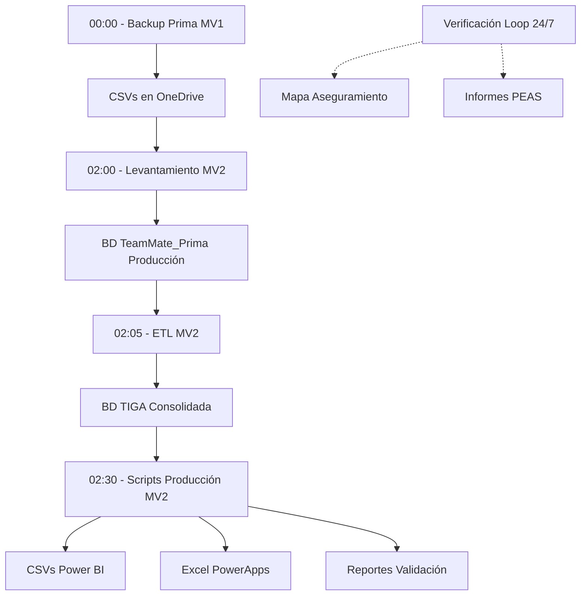

# Sistema ETL de Auditoría Interna - Pacífico Seguros

## 📋 Descripción General

Sistema integral de **Extracción, Transformación y Carga (ETL)** que automatiza la consolidación de datos de auditoría desde las plataformas TeamMate (Prima y Pacífico) hacia una base de datos centralizada (TIGA - PROYECTOSIAV2), generando fuentes de datos para dashboards de Power BI, PowerApps y reportes especializados.

## 🎯 Objetivo del Sistema

Automatizar completamente el flujo de datos de auditoría para:
- Consolidar información de múltiples fuentes (TeamMate Prima, TeamMate Pacífico)
- Sincronizar observaciones, riesgos y controles en tiempo real
- Generar automáticamente reportes y dashboards actualizados
- Proporcionar fuentes de datos para aplicaciones (Auditron, PEAS, Consultas)
- Validar calidad de documentación y procesos

## 🏗️ Arquitectura del Sistema

```
┌────────────────────────────────────────────────────────────────────────┐
│                         SISTEMA ETL COMPLETO                           │
└────────────────────────────────────────────────────────────────────────┘

┌─────────────────────┐
│   MÁQUINA VIRTUAL 1 │  ← Proceso Independiente
│   (Backup Prima)    │
│                     │
│  TeamMate_Prima DB  │
│         ↓           │
│   ┌─────────────┐   │
│   │  main.py    │   │
│   │ (Backup)    │   │
│   └──────┬──────┘   │
│          ↓          │
│   26 archivos CSV   │
└──────────┼──────────┘
           │
           ↓ [OneDrive Sync]
           
┌──────────────────────────────────────────────────────────────────────────┐
│                       MÁQUINA VIRTUAL 2                                  │
│                    (Procesos Principales)                                │
│                                                                          │
│  ┌────────────────────────────────────────────────────────────────────┐ │
│  │  PASO 1: Levantamiento                                             │ │
│  │  ├── ultimito.py                                                   │ │
│  │  ├── Lee 26 CSVs desde OneDrive                                    │ │
│  │  ├── Carga datos a TeamMate_Prima (Producción)                     │ │
│  │  └── Tiempo: 2-3 minutos                                           │ │
│  └────────────────────────────────────────────────────────────────────┘ │
│                              ↓                                           │
│  ┌────────────────────────────────────────────────────────────────────┐ │
│  │  PASO 2: ETL (Transformación)                                      │ │
│  │  ├── main.py                                                       │ │
│  │  ├── Procesa Observaciones (Insert/Update Pacífico y Prima)        │ │
│  │  ├── Procesa Riesgos y Controles (Insert/Update Pacífico y Prima) │ │
│  │  ├── Aplica Excepciones                                            │ │
│  │  ├── Sincroniza hacia TIGA (PROYECTOSIAV2)                        │ │
│  │  └── Tiempo: 15-25 minutos                                         │ │
│  └────────────────────────────────────────────────────────────────────┘ │
│                              ↓                                           │
│  ┌────────────────────────────────────────────────────────────────────┐ │
│  │  PASO 3: Scripts Producción (Generación de Salidas)               │ │
│  │  ├── PY001_ScriptsInnovacion/main.py                              │ │
│  │  ├── Apps.py → Genera fuentes PowerApps (Auditron, PEAS)          │ │
│  │  ├── Dashboards.py → Genera 35+ CSVs para Power BI                │ │
│  │  ├── Validación de carpetas y calidad                             │ │
│  │  └── Tiempo: 10-15 minutos                                         │ │
│  └────────────────────────────────────────────────────────────────────┘ │
│                                                                          │
│  ┌────────────────────────────────────────────────────────────────────┐ │
│  │  PROCESO PARALELO: Verificación (Loop Continuo)                   │ │
│  │  ├── verificacion.py (ejecuta cada 2.5 minutos)                   │ │
│  │  ├── Monitorea archivos _v2.xlsx                                   │ │
│  │  ├── Procesa Mapa de Aseguramiento (on-demand)                    │ │
│  │  ├── Genera informes PEAS (on-demand)                             │ │
│  │  └── Independiente del flujo ETL principal                         │ │
│  └────────────────────────────────────────────────────────────────────┘ │
└──────────────────────────────────────────────────────────────────────────┘

                              ↓ ↓ ↓ SALIDAS ↓ ↓ ↓

┌──────────────────────┐  ┌──────────────────────┐  ┌──────────────────────┐
│   Power BI           │  │   PowerApps          │  │   SharePoint         │
│   35+ Dashboards     │  │   - Auditron         │  │   Reportes Excel     │
│   - Observaciones    │  │   - PEAS             │  │   Documentación      │
│   - Riesgos          │  │   - Consultas        │  │   Validaciones       │
│   - Controles        │  │   - Auditados        │  │                      │
│   - Indicadores      │  │                      │  │                      │
└──────────────────────┘  └──────────────────────┘  └──────────────────────┘
```

## 📂 Estructura de Carpetas

```
PROYECTOS/
├── README.md                    # ← ESTE ARCHIVO (Documentación General)
│
├── Backup_Prima/                # PASO 0: Exportación de datos (MV1)
│   ├── main.py                  # Script de exportación
│   └── README.md                # Documentación específica
│
├── Levantamiento/               # PASO 1: Carga de CSVs a BD (MV2)
│   ├── ultimito.py              # Script de carga
│   ├── queries/                 # Scripts SQL de preparación
│   └── README.md                # Documentación específica
│
├── ETL/                         # PASO 2: Transformación de datos (MV2)
│   ├── main.py                  # Orquestador principal
│   ├── conection.py             # Configuración de conexiones
│   ├── scripts/                 # Scripts de procesamiento
│   │   ├── scripts.py           # ETL de observaciones
│   │   ├── insert_ps.py         # Insert Riesgos/Controles Pacífico
│   │   ├── insert_pri.py        # Insert Riesgos/Controles Prima
│   │   ├── update_ps.py         # Update Pacífico
│   │   └── update_pri.py        # Update Prima
│   ├── excepciones/             # Manejo de excepciones
│   ├── queries/                 # 27+ queries SQL organizadas
│   └── README.md                # Documentación específica
│
├── scripts_produccion/          # PASO 3: Generación de salidas (MV2)
│   └── PY001_ScriptsInnovacion/
│       ├── main.py              # Orquestador
│       ├── scripts/             # Módulos de generación
│       │   ├── Apps.py          # Fuentes PowerApps
│       │   └── Dashboards.py    # Fuentes Power BI
│       ├── queries/             # 60+ queries SQL
│       ├── fuentes.py           # Carga de dataframes
│       ├── functions.py         # Funciones auxiliares
│       ├── params.py            # Configuración
│       └── README.md            # Documentación específica
│
└── verificacion/                # PROCESO PARALELO: Monitor continuo (MV2)
    └── creacion/
        ├── verificacion.py      # Monitor principal (loop cada 2.5 min)
        ├── functions.py         # Funciones auxiliares
        ├── params.py            # Configuración
        ├── PEAS.py             # Generación PEAS
        └── README.md            # Documentación específica
```

## 🔄 Flujo de Datos Completo

### Flujo Secuencial Diario



## 📊 Procesos Detallados

### 1️⃣ Backup Prima (MV1 - Independiente)

**Ubicación:** [`Backup_Prima/`](Backup_Prima/README.md)

**Función:** Exportar 26 tablas desde TeamMate_Prima a archivos CSV

**Ejecución:** Diaria (00:00 AM)

**Detalles:**
- Conecta a: `C35T01WPDB01/TeamMate_Prima`
- Exporta: 26 tablas críticas (Observaciones, Proyectos, Riesgos, Controles, etc.)
- Destino: Carpeta sincronizada OneDrive
- Tiempo: 30-60 segundos
- Formato: CSV con UTF-8-BOM

**Tablas Exportadas:**
```
TM_Recommendation, TM_RecommendationAction, TM_Issue, TM_Schedule,
TM_Project, TM_CategoryValue, TM_SecurityGroup, TM_Auditor, TM_User,
EWP_Control, EWP_Risk, EWP_RiskToControl, TM_ObjectAction, ...
```

### 2️⃣ Levantamiento (MV2)

**Ubicación:** [`Levantamiento/`](Levantamiento/README.md)

**Función:** Cargar CSVs sincronizados a base de datos de producción

**Ejecución:** Diaria (02:00 AM) - Después de Backup_Prima

**Detalles:**
- Lee: 26 CSVs desde OneDrive sincronizado
- Conecta a: `PSTMMPRD0300/TeamMate_Prima`
- Carga en 3 grupos respetando dependencias FK
- Maneja: IDENTITY_INSERT, validaciones de nulos, conversión de tipos
- Tiempo: 2-3 minutos

**Proceso:**
```python
# Pre-carga
- drop_object_action.sql
- truncate.sql (limpia todas las tablas)

# Carga Grupo 1 (9 tablas base)
TM_RecommendationAction, TM_Recommendation, TM_Schedule, ...

# Carga Grupo 2 (1 tabla especial)
TM_ObjectAction

# Carga Grupo 3 (16 tablas dependientes)
EWP_Control, EWP_Risk, TM_AuthRecommendation, ...

# Post-carga
- object_action.sql (recrea lógica especial)
```

### 3️⃣ ETL - Transformación (MV2)

**Ubicación:** [`ETL/`](ETL/README.md)

**Función:** Sincronizar y transformar datos entre TeamMate y TIGA

**Ejecución:** Diaria (02:05 AM) - Después de Levantamiento

**Detalles:**
- Conecta a 3 bases de datos:
  - `PSTMMPRD0300/TeamMate_Prima` (fuente)
  - `PSTMMPRD0300/TeamMateR12` (fuente Pacífico)
  - `PSTMMPRD0300/PROYECTOSIAV2` (destino TIGA)
- Tiempo: 15-25 minutos

**Subprocesos:**

#### 3.1 Observaciones (run_etl)
```
→ Pacífico Insert (6 queries)
→ Pacífico Update (5 queries)
→ Prima Insert (8 queries)
→ Prima Update (8 queries)
Tiempo: 5-8 minutos
```

#### 3.2 Riesgos y Controles
```
→ Insert Pacífico (insertar_ps)
  - Lee cambios desde TeamMateR12
  - Calcula métricas (Impacto, Frecuencia, IFC)
  - Construye matriz de 85 columnas
  
→ Insert Prima (insertar_pri)
  - Similar a Pacífico pero para Prima

→ Update Pacífico (update_ps)
→ Update Prima (update_pri)

Tiempo: 8-12 minutos
```

#### 3.3 Excepciones (excepcionesobs)
```
→ Aplica reglas especiales desde excepciones-obs.csv
Tiempo: 1-2 minutos
```

**Tablas Destino en TIGA:**
- `TG_Observacion`
- `TG_ALL_Observacion`
- `TG_Observacion_Historial`
- `TG_Contacto`
- `TG_Riesgos_Controles`
- Tablas auxiliares de comparación

### 4️⃣ Scripts Producción - Salidas (MV2)

**Ubicación:** [`scripts_produccion/PY001_ScriptsInnovacion/`](scripts_produccion/README.md)

**Función:** Generar todos los reportes y fuentes de datos

**Ejecución:** Diaria (02:30 AM) - Después de ETL

**Detalles:**
- Lee datos consolidados de TIGA
- Ejecuta 60+ queries SQL
- Genera múltiples formatos de salida
- Tiempo: 10-15 minutos

**Módulos:**

#### 4.1 Apps.py - Fuentes PowerApps
```
→ AppsAuditron()
  - Anexo 12
  - Matriz de Calificación
  - Matriz de Pruebas
  - Programa Trabajo Credicorp

→ Fuentes Consultas (Excel con tablas formateadas)
→ Fuentes PEAS (Base de evaluaciones)
→ Fuentes Auditados (Observaciones por área)

Formatos: Excel (.xlsx) con tablas nativas
Tiempo: 2-3 minutos
```

#### 4.2 Dashboards.py - Fuentes Power BI
```
→ DashboardsInnovacion()
  Genera 35+ archivos CSV:
  - StockObservaciones.csv
  - HistorialObservaciones.csv
  - ValidacionPlan.csv
  - EfectividadControles.csv
  - RiesgosControles.csv
  - EquipoAuditoria.csv
  - IndicadoresDesempenio.csv
  - ProyectosConsolidado.csv
  - MapaAseguramientoBI.xlsx
  - ... (25+ más)

→ ValidacionCarpetas()
  Valida estructura de carpetas de proyectos

→ calidad_carpetas()
  Auditoría de completitud de documentación

Formatos: CSV para Power BI, Excel para análisis
Tiempo: 5-8 minutos
```

**Procesamiento Especial:**
```python
# Stock Observaciones Diario
- Calcula estado actual de cada observación
- Determina: Vencido vs En Fecha
- Calcula ampliaciones aprobadas
- Filtra por TI (vista especial)

# Validaciones
- Verifica existencia de carpetas por negocio
- Valida documentación completa
- Genera reportes de calidad
```

### 5️⃣ Verificación - Monitor Continuo (MV2)

**Ubicación:** [`verificacion/creacion/`](verificacion/README.md)

**Función:** Monitoreo continuo para procesos on-demand

**Ejecución:** Loop infinito cada 2.5 minutos (24/7)

**Detalles:**
- Proceso paralelo e independiente
- No depende del flujo ETL principal
- 576 verificaciones por día

**Procesos Monitoreados:**

#### 5.1 Mapa de Aseguramiento (ACTIVO)
```
Monitorea: *_v2.xlsx en carpetas de negocio

Cuando detecta archivo:
1. Lee datos del Excel
2. Elimina registros duplicados en BD
3. Inserta nuevos datos en TG_MapaAseguramiento
4. Elimina archivo procesado

Negocio: Pacífico, Prima AFP, Crediseguro, Salud
```

#### 5.2 Informes PEAS (ACTIVO)
```
Monitorea: base_creacion_peas_v2.xlsx

Cuando detecta archivo:
1. Lee código de proyecto y negocio
2. Busca fuente PEAS_{proyecto}.xlsx
3. Obtiene datos de BD (info_peas.sql)
4. Genera informe consolidado
5. Guarda en carpeta de documentación del proyecto
6. Elimina archivos procesados
```

#### 5.3 Plantillas e Imágenes (DESHABILITADOS)
```
# Capacidades (actualmente comentadas):
- Generación de PPTs (Sprint Planning, Informes, Observaciones)
- Mapas de calor de riesgos
- Gráficos evolutivos de evaluaciones
```

## ⚙️ Configuración del Sistema

### Bases de Datos

```python
# Base de Datos TIGA (Destino consolidado)
CNXN_TIGA = 'Server=PSTMMPRD0300;Database=PROYECTOSIAV2;UID=USTEAM02;...'

# Base de Datos TeamMate Prima (Fuente)
CNXN_TEAMMATE_PRIMA = 'Server=PSTMMPRD0300;Database=TeamMate_Prima;UID=USTEAM02;...'

# Base de Datos TeamMate Pacífico (Fuente)
CNXN_TEAMMATE_PS = 'Server=PSTMMPRD0300;Database=TeamMateR12;UID=USTEAM02;...'

# Base de Datos Backup Prima (Fuente original - MV1)
CNXN_BACKUP = 'Server=C35T01WPDB01;Database=TeamMate_Prima;UID=TeamMateUser_Prima2023;...'
```

### Rutas de SharePoint

```python
# Rutas compartidas (sincronizadas OneDrive)
SHAREPOINT_BASE = r'E:\Sharepoint\Pacífico Compañía de Seguros y Reaseguros\Analítica e Innovación en Auditoría - 01. Resultados Scripts'

# Backup CSVs
BACKUP_CSV_PATH = f'{SHAREPOINT_BASE}\backup_prima_csv'

# Power BI
OUTPUT_PATH_PBI = f'{SHAREPOINT_BASE}\POWER BI'

# PowerApps
OUTPUT_PATH_APPS = f'{SHAREPOINT_BASE}\Apps'
OUTPUT_PATH_AUDITRON = f'{SHAREPOINT_BASE}\Auditron'
OUTPUT_PATH_PEAS = f'{SHAREPOINT_BASE}\PEAS'

# Mapa Aseguramiento
MAPA_ASEGURAMIENTO_PATH = f'{SHAREPOINT_BASE}\Mapa_Aseguramiento'
```

## 🕐 Programación de Ejecución

### Ejecución Diaria Automática

```
00:00 AM - Backup Prima (MV1)
   ↓ (Sincronización OneDrive: ~5 min)
02:00 AM - Levantamiento (MV2)
   ↓ (2-3 minutos)
02:05 AM - ETL (MV2)
   ↓ (15-25 minutos)
02:30 AM - Scripts Producción (MV2)
   ↓ (10-15 minutos)
02:45 AM - ✅ PROCESO COMPLETO

Duración Total: ~45-50 minutos
```

### Proceso Continuo

```
Verificación (MV2): Loop infinito 24/7
- Ejecuta cada 2.5 minutos
- 576 ciclos por día
- Procesa solicitudes on-demand
```

## 🛠️ Dependencias del Sistema

### Python (3.8+)

```bash
# Librerías Core
pip install pyodbc          # Conexiones SQL Server
pip install pandas          # Procesamiento de datos
pip install numpy           # Operaciones numéricas
pip install openpyxl        # Lectura/escritura Excel
pip install sqlalchemy      # ORM SQL
pip install python-dateutil # Manejo de fechas

# Opcional (módulos deshabilitados)
# pip install python-pptx   # Generación de PowerPoint
# pip install matplotlib    # Gráficos
# pip install pillow        # Procesamiento de imágenes
```

### Software Requerido

- **ODBC Driver 17 for SQL Server**
- **Python 3.8 o superior**
- **OneDrive** (sincronización automática)
- **Acceso a red** para servidores SQL

### Permisos Requeridos

- **Lectura**: TeamMate_Prima, TeamMateR12 (ambos servidores)
- **Escritura**: PROYECTOSIAV2 (TIGA)
- **Carpetas**: Lectura/Escritura en rutas SharePoint sincronizadas

## 📊 Métricas del Sistema

### Volumen de Datos

```
Tablas Procesadas: 26 tablas principales
Registros Diarios: ~500K+ registros procesados
Archivos Generados: 40+ archivos de salida diarios
Queries Ejecutadas: 90+ queries SQL por ciclo
```

### Tiempos de Ejecución

| Proceso | Tiempo Estimado | Frecuencia |
|---------|----------------|------------|
| Backup Prima | 30-60 seg | Diario |
| Levantamiento | 2-3 min | Diario |
| ETL | 15-25 min | Diario |
| Scripts Producción | 10-15 min | Diario |
| Verificación | Continuo | Cada 2.5 min |
| **TOTAL DIARIO** | **~45-50 min** | **1 vez/día** |

### Consumidores de Datos

- **Power BI**: 35+ dashboards actualizados diariamente
- **PowerApps**: 4 aplicaciones (Auditron, PEAS, Consultas, Auditados)
- **Usuarios Directos**: 50+ analistas de auditoría
- **Reportes Excel**: 15+ reportes especializados

## 🔍 Monitoreo y Mantenimiento

### Logs del Sistema

Cada proceso genera logs detallados:

```python
# ETL/log.txt
[2025-12-12 02:05:23] Iniciando ETL
[2025-12-12 02:05:45] Observaciones: 1,234 filas afectadas ✔️
[2025-12-12 02:12:15] Riesgos y Controles: 5,678 filas afectadas ✔️
[2025-12-12 02:25:30] Proceso completado exitosamente

# scripts_produccion/log.csv
Fecha,Proceso,Estado,Tiempo,Registros
2025-12-12,DashboardsInnovacion,Exito,485 seg,45678
2025-12-12,AppsAuditron,Exito,123 seg,2345
```

### Verificación de Salud

```bash
# Verificar que todos los CSVs fueron generados
ls -l "E:\Sharepoint\...\POWER BI\*.csv" | wc -l
# Esperado: 35+ archivos

# Verificar última ejecución exitosa
Get-Content "E:\Proyectos\ETL\log.txt" -Tail 10

# Verificar sincronización OneDrive
Test-Path "D:\Sharepoint\...\backup_prima_csv\TM_Recommendation.csv"
```

### Puntos de Fallo Comunes

1. **Sincronización OneDrive interrumpida**
   - Síntoma: Levantamiento no encuentra CSVs
   - Solución: Verificar sincronización de OneDrive

2. **Conexión a BD fallida**
   - Síntoma: Error de timeout en conexión
   - Solución: Verificar conectividad de red, credenciales

3. **Espacio en disco insuficiente**
   - Síntoma: Error al escribir archivos
   - Solución: Limpiar archivos antiguos, aumentar espacio

4. **Queries con timeout**
   - Síntoma: ETL se detiene en query específica
   - Solución: Optimizar query, revisar índices de BD

5. **Archivos Excel bloqueados**
   - Síntoma: Verificación no puede procesar archivo
   - Solución: Cerrar Excel, verificar permisos

## 🚨 Procedimientos de Recuperación

### Si falla Backup Prima

```bash
# Ejecutar manualmente
cd "C:\ruta\Backup_Prima"
python main.py

# Verificar salida
dir "D:\Sharepoint\...\backup_prima_csv\*.csv"
```

### Si falla Levantamiento

```bash
# Verificar que CSVs existen
# Ejecutar manualmente
cd "E:\Proyectos\ETL\Levantamiento"
python ultimito.py
```

### Si falla ETL

```bash
# Revisar log para identificar proceso fallido
# Ejecutar manualmente
cd "E:\Proyectos\ETL\Oficial"
python main.py

# Si falla un subproceso específico, ejecutar individualmente:
# cd scripts
# python insert_ps.py
```

### Si falla Scripts Producción

```bash
cd "E:\Proyectos\ETL\scripts_produccion\PY001_ScriptsInnovacion"
python main.py

# Verificar salidas
dir "E:\Sharepoint\...\POWER BI\*.csv"
```

## 📚 Documentación Detallada

Cada módulo tiene su documentación específica:

- **[Backup_Prima/README.md](Backup_Prima/README.md)** - Exportación de datos
- **[Levantamiento/README.md](Levantamiento/README.md)** - Carga de CSVs
- **[ETL/README.md](ETL/README.md)** - Transformación de datos
- **[scripts_produccion/README.md](scripts_produccion/README.md)** - Generación de salidas
- **[verificacion/README.md](verificacion/README.md)** - Monitor continuo

## 🔐 Seguridad

### Credenciales

- Todas las credenciales están hardcodeadas (considerar migrar a variables de entorno)
- Acceso restringido a servidores de BD
- Carpetas SharePoint con permisos específicos por equipo

### Recomendaciones

```python
# TODO: Migrar a variables de entorno
import os
DB_PASSWORD = os.getenv('TIGA_DB_PASSWORD')

# TODO: Implementar secrets management
# - Azure Key Vault
# - HashiCorp Vault
# - AWS Secrets Manager
```

## 🔄 Actualizaciones y Mejoras Futuras

### En Roadmap

1. **Migración de credenciales** a variables de entorno
2. **Implementar logging centralizado** (ELK Stack)
3. **Notificaciones por email** en caso de fallos
4. **Dashboard de monitoreo** del sistema ETL
5. **Pruebas automatizadas** para validar integridad de datos
6. **Paralelización** de procesos independientes
7. **Reactivar módulos** de plantillas e imágenes
8. **API REST** para consultas a TIGA

### Mejoras de Performance

- Implementar cache para queries frecuentes
- Optimizar queries SQL con índices adicionales
- Usar bulk insert para cargas masivas
- Implementar procesamiento paralelo en ETL

## 📞 Soporte

### Contacto

**Equipo:** Analítica e Innovación en Auditoría Interna  
**Empresa:** Pacífico Compañía de Seguros y Reaseguros  
**Email:** [Pendiente configurar]  
**SharePoint:** [Ruta de documentación]

### Escalamiento de Problemas

1. **Nivel 1**: Verificar logs y documentación
2. **Nivel 2**: Contactar a desarrollador del módulo específico
3. **Nivel 3**: Contactar a arquitecto del sistema
4. **Nivel 4**: Involucrar a IT/Infraestructura

## 📋 Checklist de Implementación

### Setup Inicial

- [ ] Instalar Python 3.8+ en ambas MVs
- [ ] Instalar ODBC Driver 17 for SQL Server
- [ ] Configurar OneDrive en MV1 y MV2
- [ ] Crear carpetas en SharePoint
- [ ] Configurar permisos de BD
- [ ] Instalar dependencias Python (`pip install -r requirements.txt`)
- [ ] Configurar tareas programadas de Windows
- [ ] Probar conectividad a BDs
- [ ] Ejecutar prueba completa del flujo
- [ ] Verificar generación de todos los archivos de salida
- [ ] Configurar monitoreo y alertas

### Validación Post-Implementación

- [ ] Verificar que Backup genera 26 CSVs
- [ ] Verificar que Levantamiento carga todas las tablas
- [ ] Verificar que ETL no tiene errores en logs
- [ ] Verificar que se generan 35+ CSVs para Power BI
- [ ] Verificar que PowerApps reciben fuentes actualizadas
- [ ] Verificar que Verificación está en loop continuo
- [ ] Validar tiempos de ejecución dentro de lo esperado
- [ ] Confirmar que dashboards de Power BI se actualizan

## 📖 Glosario

- **TIGA**: Base de datos consolidada PROYECTOSIAV2
- **TeamMate**: Sistema de gestión de auditorías
- **Prima/Pacífico**: Diferentes instancias de TeamMate por compañía
- **PEAS**: Programa de Evaluación de Auditoría por Sistemas
- **Mapa de Aseguramiento**: Documentación de riesgos y controles por proyecto
- **Observaciones**: Hallazgos de auditoría
- **Riesgos y Controles**: Matriz de evaluación de controles internos
- **MV1/MV2**: Máquinas Virtuales 1 y 2
- **OneDrive Sync**: Sincronización automática de carpetas SharePoint

---

**Versión del Sistema**: 2.0  
**Última Actualización**: Diciembre 2025  
**Autor**: Equipo Analítica e Innovación en Auditoría  
**Estado**: Producción (Operativo)
