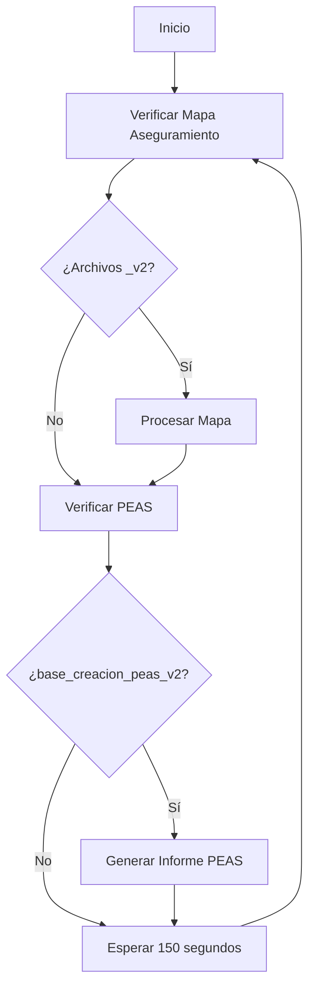

# Verificación - Monitor de Fuentes y Desencadenamiento de Procesos

## 📋 Descripción General

**Verificación** es un proceso **continuo y paralelo** que se ejecuta cada **2.5 minutos** (150 segundos) en un ciclo infinito. Su función es monitorear la existencia de archivos específicos que actúan como disparadores para desencadenar procesos automatizados de creación de documentos, mapas de aseguramiento y reportes PEAS.

Este proceso NO sigue el flujo secuencial de los otros módulos (Backup_Prima → Levantamiento → ETL → scripts_produccion), sino que opera de forma independiente y paralela.

## 🎯 Objetivo

Monitorear carpetas específicas en busca de archivos Excel que contienen solicitudes de:
1. **Mapa de Aseguramiento** - Inserción de datos de mapas
2. **PEAS** (Programa de Evaluación de Auditoría por Sistemas) - Generación de informes
3. **Plantillas** (Deshabilitado) - Creación de PPTs de informes y observaciones
4. **Imágenes** (Deshabilitado) - Generación de mapas de calor y evolutivos

## 🏗️ Arquitectura

```
┌──────────────────────────────────────────┐
│   Verificación (Loop cada 2.5 minutos)  │
│   verificacion.py                        │
└──────────────┬───────────────────────────┘
               │
               ▼
┌──────────────────────────────────────────┐
│   Monitoreo de Carpetas                  │
│                                          │
│   ┌────────────────────────────────┐    │
│   │  Mapa Aseguramiento            │    │
│   │  ¿Existe Excel _v2?            │    │
│   │  → Leer datos                  │    │
│   │  → Insertar en TIGA            │    │
│   │  → Eliminar archivo            │    │
│   └────────────────────────────────┘    │
│                                          │
│   ┌────────────────────────────────┐    │
│   │  PEAS                          │    │
│   │  ¿Existe base_creacion_peas_v2?│    │
│   │  → Leer proyecto               │    │
│   │  → Generar informes            │    │
│   │  → Eliminar archivos           │    │
│   └────────────────────────────────┘    │
│                                          │
│   ┌────────────────────────────────┐    │
│   │  Plantillas (Deshabilitado)    │    │
│   │  - Sprint Planning             │    │
│   │  - Informes Final/Borrador     │    │
│   │  - Observaciones               │    │
│   └────────────────────────────────┘    │
│                                          │
│   ┌────────────────────────────────┐    │
│   │  Imágenes (Deshabilitado)      │    │
│   │  - Mapas de calor              │    │
│   │  - Evolutivos                  │    │
│   └────────────────────────────────┘    │
└──────────────────────────────────────────┘
               │
               ▼
          time.sleep(150)
               │
               └────────► [REINICIO DEL CICLO]
```

## 📂 Estructura de Archivos

```
verificacion/
└── creacion/
    ├── verificacion.py      # Script principal del monitor
    ├── verificacion.bat     # Ejecutable batch
    ├── functions.py         # Funciones auxiliares
    ├── params.py            # Parámetros y rutas
    ├── PEAS.py             # Generación de reportes PEAS
    ├── creaciones.py       # Creación de plantillas (deshabilitado)
    ├── IMAGENES.py         # Generación de imágenes (deshabilitado)
    └── imagenes.bat        # Batch de imágenes
```

## 🔧 Configuración (params.py)

### Rutas de Monitoreo

```python
# Carpetas donde se buscan archivos disparadores
EXCEL_PATH = r'E:\Sharepoint\...\base_creacion_ppts'
EXCEL_IMAGENES_PATH = r'E:\Sharepoint\...\informe_insertar'
PEAS_PATH = r'E:\Sharepoint\...\PEAS'
MAPA_ASEGURAMIENTO_PATH = r'E:\Sharepoint\...\Mapa_Aseguramiento'

# Carpetas de salida
PEAS_PATH_OUTPUT = r'E:\Sharepoint\...\PEAS_OUTPUT'
MAPAYEVOLUTIVO_PATH = r'E:\Sharepoint\...\Mapa_y_Evolutivo'
FINAL_PATH = r'E:\Sharepoint\...\Documentacion'

# Rutas por negocio
list_ruta_negocio = [
    r'E:\Sharepoint\...\Pacifico',
    r'E:\Sharepoint\...\Prima AFP',
    r'E:\Sharepoint\...\Crediseguro',
    r'E:\Sharepoint\...\Salud'
]
```

### Conexión a Base de Datos

```python
CNXN_TIGA = (
    'Driver={ODBC Driver 17 for SQL Server};'
    'database=PROYECTOSIAV2;'
    'server=PSTMMPRD0300;'
    'uid=USTEAM02;'
    'pwd=ZU4repezaGefraMu;'
    'encrypt=no;'
)
```

## ⚙️ Funcionamiento del Proceso Principal

### Loop Principal (verificacion.py)

```python
def main():
    # Definir rutas de archivos a monitorear
    file_path_v2 = os.path.join(EXCEL_PATH, "base_creacion_ppts_v2.xlsx")
    file_path_informe_v2 = os.path.join(EXCEL_IMAGENES_PATH, "informe_insertar_v2.xlsx")
    file_path_pea_v2 = os.path.join(PEAS_PATH, "base_creacion_peas_v2.xlsx")
    
    # Contar archivos Excel en carpeta de Mapa Aseguramiento
    excel_file_count, excel_file_paths = count_and_store_excel_files(
        MAPA_ASEGURAMIENTO_PATH, 
        list_ruta_negocio
    )
```

### 1. Proceso: Mapa de Aseguramiento (ACTIVO)

Este es el proceso principal actualmente activo:

```python
try:
    if excel_file_count > 0:
        print("---------- MAPA ASEGURAMIENTO -----------")
        print(excel_file_count)
        
        # Leer datos de los archivos Excel
        data_matrix = read_excel_sheets(excel_file_paths)
        
        # Eliminar registros existentes para evitar duplicados
        delete_exists_asegurate_map(excel_file_paths, CNXN_TIGA)
        
        # Insertar datos en base de datos
        simulate_procedure_call(data_matrix, CNXN_TIGA)
        
        # Eliminar archivos procesados
        delete_analyzed_files(excel_file_paths)
    else:
        print("Error al generar inserts en sql - Mapa Aseguramiento")

except Exception as e:
    print(f"Error: {e}")
    time.sleep(10)
```

#### Funciones Auxiliares del Mapa

##### count_and_store_excel_files()
```python
def count_and_store_excel_files(base_path, rutas_negocio):
    """
    Busca archivos Excel con sufijo '_v2.xlsx' en carpetas de negocio
    Retorna: (contador, lista de rutas)
    """
    excel_files = []
    for ruta in rutas_negocio:
        full_path = os.path.join(base_path, ruta)
        if os.path.exists(full_path):
            for file in os.listdir(full_path):
                if file.endswith('_v2.xlsx'):
                    excel_files.append(os.path.join(full_path, file))
    
    return len(excel_files), excel_files
```

##### read_excel_sheets()
```python
def read_excel_sheets(excel_paths):
    """
    Lee todos los archivos Excel y consolida datos
    Retorna: DataFrame consolidado
    """
    data_matrix = []
    for path in excel_paths:
        df = pd.read_excel(path)
        data_matrix.append(df)
    
    return pd.concat(data_matrix, ignore_index=True)
```

##### delete_exists_asegurate_map()
```python
def delete_exists_asegurate_map(excel_paths, cnxn):
    """
    Elimina registros existentes antes de insertar nuevos
    para evitar duplicados
    """
    cursor = cnxn.cursor()
    for path in excel_paths:
        df = pd.read_excel(path)
        ids = df['ID'].tolist()
        
        delete_query = f"""
        DELETE FROM TG_MapaAseguramiento 
        WHERE ID IN ({','.join(map(str, ids))})
        """
        cursor.execute(delete_query)
    
    cursor.commit()
```

##### simulate_procedure_call()
```python
def simulate_procedure_call(data_matrix, cnxn):
    """
    Inserta datos del mapa de aseguramiento en la base de datos
    """
    cursor = cnxn.cursor()
    
    for idx, row in data_matrix.iterrows():
        insert_query = """
        INSERT INTO TG_MapaAseguramiento 
        (Proyecto, Proceso, Subproceso, Riesgo, Control, ...)
        VALUES (?, ?, ?, ?, ?, ...)
        """
        cursor.execute(insert_query, tuple(row))
    
    cursor.commit()
```

##### delete_analyzed_files()
```python
def delete_analyzed_files(excel_paths):
    """
    Elimina archivos Excel procesados
    """
    for path in excel_paths:
        if os.path.exists(path):
            os.remove(path)
            print(f"Archivo eliminado: {path}")
```

### 2. Proceso: PEAS (ACTIVO)

Genera informes del Programa de Evaluación de Auditoría:

```python
try:
    if os.path.exists(file_path_pea_v2):
        print("----- PEAS -----")
        
        # Obtener información del proyecto
        proyecto = obtener_proyecto_peas(file_path_pea_v2)
        negocio = obtener_NEGOCIO_peas(file_path_pea_v2)
        proyecto_limpio = proyecto.replace(' ', '')
        
        # Obtener datos de la base de datos
        df_datos = obtenerDatosDe3('info_peas')
        
        # Leer fuente procesada
        df_procesada = pd.read_excel(
            os.path.join(PEAS_PATH_OUTPUT, f'PEAS_{proyecto_limpio}.xlsx')
        )
        
        if not df_procesada.empty:
            print("Se leyo correctamente")
            # Generar informes
            generar_informes(df_datos, df_procesada, proyecto, negocio)
        else:
            print("Fuente de proyecto sin sincronizar")
        
        # Eliminar archivos procesados
        os.remove(file_path_pea_v2)
        file_to_remove = os.path.join(
            PEAS_PATH_OUTPUT, 
            f'PEAS_{proyecto_limpio}.xlsx'
        )
        os.remove(file_to_remove)
        
    else:
        print("base de creacion peas no existe")
    
    time.sleep(10)

except Exception as e:
    print(f"Error: {e}")
    time.sleep(20)
```

#### Funciones PEAS

##### obtener_proyecto_peas()
```python
def obtener_proyecto_peas(file_path):
    """Lee el código del proyecto del Excel"""
    df = pd.read_excel(file_path)
    codigo = df['CODIGO'].iloc[-1]
    return codigo
```

##### obtener_NEGOCIO_peas()
```python
def obtener_NEGOCIO_peas(file_path):
    """Lee el negocio del Excel"""
    df = pd.read_excel(file_path)
    negocio = df['NEGOCIO'].iloc[-1]
    return negocio
```

##### generar_informes() (PEAS.py)
```python
def generar_informes(df_datos, df_procesada, proyecto, negocio):
    """
    Genera informes PEAS consolidados
    - Combina datos de base de datos con fuente procesada
    - Genera Excel formateado
    - Guarda en carpeta de documentación del proyecto
    """
    # Procesamiento y generación de informe
    # ...
```

### 3. Proceso: Plantillas (DESHABILITADO)

Este proceso está comentado pero permite generar PPTs automáticos:

```python
'''
try:
    if os.path.exists(file_path_v2):
        print("------ PLANTILLAS ------")
        
        tipo, negocio = obtener_tipo_de_Excel(file_path_v2)
        codigo = obtener_codigo_de_Excel(file_path_v2)
        
        if tipo == 'Sprint Planning':
            df_datos = obtenerDatosDe("memorando")
            create_memorando(tipo, negocio, codigo, df_datos)
            
        elif tipo == 'Informe Final' or tipo == 'Informe Borrador':
            df_datos = obtenerDatosDe("memorando")
            df_calificativo_total = obtenerDatosDe("calificativo_total")
            df_calificativo_unidad_responsable = obtenerDatosDe("calificativo_unidad_responsable")
            df_cantidad_controles = obtenerDatosDe("cantidad_controles")
            df_observaciones_informe = obtenerDatosDe("observaciones_informe")
            
            create_informe_ppt(tipo, negocio, codigo, df_datos, ...)
            
        elif tipo == 'Observaciones Final' or tipo == 'Observaciones Borrador':
            df_datos = obtenerDatosDe('Observaciones')
            create_observaciones_ppt(tipo, negocio, codigo, df_datos)
        
        os.remove(file_path_v2)
        
except Exception as e:
    print(f"Error: {e}")
'''
```

### 4. Proceso: Imágenes (DESHABILITADO)

Genera mapas de calor y gráficos evolutivos:

```python
'''
try:
    if os.path.exists(file_path_informe_v2):
        print("----------- IMAGENES ----------")
        
        negocio = obtener_tipo_de_Excel_informe(file_path_informe_v2)
        codigo = obtener_codigo_de_Excel_informe(file_path_informe_v2)
        
        df_efectivos_mapa = obtenerDatosDe2("efectivos_mapa_calor")
        df_cantidades_mapa = obtenerDatosDe2("cantidades_mapa_calor")
        df_encontrado_evaluacion = obtenerDatosDe2("encontrar_evaluacion")
        
        # Crear mapa de calor
        create_mapa_calor(negocio, codigo, df_efectivos_mapa, df_cantidades_mapa)
        
        # Crear gráfico evolutivo
        create_evolutivo(id_evaluacion)
        
        os.remove(file_path_informe_v2)
        
except Exception as e:
    print(f"Error: {e}")
'''
```

## 🔍 Funciones Auxiliares (functions.py)

### Obtención de Datos con Reemplazo de Variables

```python
def reemplazarVariablesQueries(query: str) -> str:
    """Reemplaza %proyecto_reemplazo% con código real"""
    file_path = os.path.join(EXCEL_PATH, "base_creacion_ppts_v2.xlsx")
    codigo = obtener_codigo_de_Excel(file_path)
    return query.replace('%proyecto_reemplazo%', codigo)

def obtenerDatosDe(nombre_query: str) -> pd.DataFrame:
    """Ejecuta query SQL con reemplazo de variables"""
    print(f"Extrayendo datos de {nombre_query}...")
    sql = reemplazarVariablesQueries(
        open(os.path.join(QUERIES_PATH, f'{nombre_query}.sql'), 'r', encoding='utf-8-sig').read()
    )
    cursor.execute(sql)
    dataframe_resultante = pd.DataFrame.from_records(
        cursor.fetchall(), 
        columns=[col[0] for col in cursor.description]
    ).drop_duplicates()
    
    print(f"Se extrajeron {len(dataframe_resultante.index)} filas y {len(dataframe_resultante.columns)} columnas.")
    return dataframe_resultante
```

### Variantes para Diferentes Procesos

```python
# Para imágenes
def obtenerDatosDe2(nombre_query: str) -> pd.DataFrame:
    """Usa reemplazarVariablesQueries2 para informe_insertar"""
    sql = reemplazarVariablesQueries2(...)
    # ...

# Para PEAS
def obtenerDatosDe3(nombre_query: str) -> pd.DataFrame:
    """Usa reemplazarVariablesQueries3 para PEAS"""
    sql = reemplazarVariablesQueries3(...)
    # ...
```

### Construcción de Rutas Dinámicas

```python
def obtenerpath3(negocio, codigo):
    """
    Construye ruta de salida según negocio, tipo de proyecto y año
    """
    programado = 'PROGRAMADOS'
    anio = '2025'
    
    if 'NPRO' in codigo:
        programado = 'NO PROGRAMADOS'
    if '2026' in codigo:
        anio = '2026'
    
    if negocio == 'Pacifico Seguros':
        final = os.path.join(FINAL_PATH, "Auditoria Interna - Evaluaciones-Documentos Seguros")
    elif negocio == 'Prima AFP':
        final = os.path.join(FINAL_PATH, "Auditoria Interna - Evaluaciones-Documentos Prima AFP")
    elif negocio == 'Pacifico Salud':
        final = os.path.join(FINAL_PATH, "Auditoria Interna - Evaluaciones-Documentos Salud")
    elif negocio == 'Crediseguro':
        final = os.path.join(FINAL_PATH, "Auditoria Interna - Evaluaciones-Documentos Crediseguro")
    
    final = os.path.join(final, anio)
    final = os.path.join(final, programado)
    final = os.path.join(final, codigo)
    final = os.path.join(final, "Documentacion")
    
    return final
```

## 🚀 Ejecución

### Manual
```bash
cd creacion
python verificacion.py
```

### Via Batch (Loop Continuo)
```batch
verificacion.bat
```

El batch debe incluir:
```batch
@echo off
:loop
python verificacion.py
timeout /t 150 /nobreak
goto loop
```

### Automatizada
Se configura como servicio de Windows o tarea programada que se ejecuta al inicio y nunca termina.

## 📈 Características Técnicas

### Patrón de Diseño: Polling

El sistema usa **polling** (consulta periódica) en lugar de eventos:
- Cada 2.5 minutos verifica existencia de archivos
- No bloquea otros procesos
- Manejo de errores independiente por proceso

### Archivo Naming Convention

**Archivos Disparadores:**
- `*_v2.xlsx` - Indica archivo listo para procesar
- Después de procesarse, el archivo se elimina automáticamente

**Proceso:**
1. Usuario/Sistema crea `archivo.xlsx`
2. Usuario renombra a `archivo_v2.xlsx` cuando está listo
3. Verificación detecta el `_v2.xlsx`
4. Procesa y elimina el archivo

### Manejo de Errores

```python
try:
    # Proceso principal
    pass
except Exception as e:
    print(f"Error: {e}")
    time.sleep(10)  # Espera adicional en caso de error
```

### Sincronización con SharePoint

- Todos los archivos monitoreados están en carpetas de SharePoint
- OneDrive sincroniza automáticamente
- El proceso lee desde carpetas locales sincronizadas

## ⏱️ Frecuencia de Ejecución

**Ciclo:** Cada 150 segundos (2.5 minutos)

**Cálculos:**
- 24 ejecuciones por hora
- 576 ejecuciones por día
- ~17,280 ejecuciones por mes

## 🎯 Casos de Uso

### 1. Inserción de Mapa de Aseguramiento

**Flujo:**
1. Usuario completa Excel de Mapa de Aseguramiento
2. Guarda como `MapaAseguramiento_Proyecto_v2.xlsx` en carpeta monitoreada
3. Verificación detecta el archivo
4. Lee datos y los inserta en `TG_MapaAseguramiento`
5. Elimina el archivo procesado

### 2. Generación de Informe PEAS

**Flujo:**
1. Sistema genera `base_creacion_peas_v2.xlsx` con código de proyecto
2. Verificación detecta el archivo
3. Lee código y negocio
4. Busca fuente `PEAS_{proyecto}.xlsx`
5. Genera informe consolidado
6. Guarda en carpeta de documentación del proyecto
7. Elimina archivos procesados

## 🛠️ Dependencias

```python
import os
import time
import pandas as pd
import pyodbc
from params import *
from functions import *
from PEAS import *
# from creaciones import * (deshabilitado)
# from IMAGENES import * (deshabilitado)
```

### Instalación
```bash
pip install pandas pyodbc openpyxl
```

## ⚠️ Consideraciones Importantes

1. **Proceso Continuo**: Nunca termina, debe estar siempre corriendo
2. **Sufijo _v2**: Es crítico para identificar archivos listos
3. **Eliminación Automática**: Los archivos se eliminan después de procesarse
4. **Carpetas Sincronizadas**: SharePoint debe estar correctamente sincronizado
5. **Conexión a BD**: Mantiene conexión abierta todo el tiempo
6. **Manejo de Concurrencia**: No hay control de concurrencia, asume un solo archivo a la vez

## 🔄 Flujo Completo



## 🔗 Integración

### Entrada
- Archivos Excel generados por usuarios o scripts anteriores
- Datos en base de datos TIGA

### Salida
- Registros insertados en `TG_MapaAseguramiento`
- Informes PEAS en carpetas de documentación de proyectos
- (Deshabilitado) PPTs de informes y observaciones
- (Deshabilitado) Imágenes de mapas de calor

### Independencia
Este proceso es **completamente independiente** del flujo ETL principal:
- No depende de Backup_Prima, Levantamiento, ETL o scripts_produccion
- Puede ejecutarse en paralelo con cualquier otro proceso
- Tiene su propio manejo de errores y logging

## 📊 Monitoreo y Logs

### Console Output
```
---------- MAPA ASEGURAMIENTO -----------
2
Registros leídos: 45
Insertando en base de datos...
Archivo eliminado: MapaAseguramiento_PRO001_v2.xlsx
----- PEAS -----
PRO002
Pacífico Seguros
Se leyo correctamente
Generando informes...
Informe guardado en: E:\Sharepoint\...\PRO002\Documentacion\
Eliminar
```

## 📞 Contacto y Soporte

Para consultas sobre este módulo, contactar al equipo de Analítica e Innovación en Auditoría.

---

**Última actualización**: Diciembre 2025  
**Versión**: 1.0  
**Autor**: Equipo Analítica e Innovación - Pacífico Seguros
